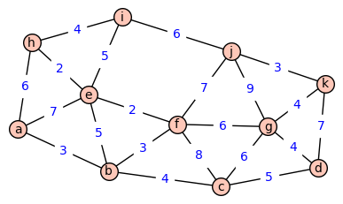

# EDyAI - Trabajo Práctico Final (24/07/2019)
## Juan Cruz de La Torre

### Introducción

### Modo de uso

```sh
$ make
$ ./main archivoEntrada archivoSalida
```

El archivo de entrada debe tener el siguiente formato:

- La primera línea contiene el encabezado `"Ciudades"`
- En la segunda línea, se encuentran los nombres de las ciudades separados por una coma y un espacio (*). Por ejemplo: `"ciudad_1, ciudad_2, ciudad_3"`
- La tercer línea contiene el encabezado `"Costos"`
- El resto de las líneas tienen el costo de ir de la ciudad i-ésima a la ciudad j-ésima de la siguiente manera: `"ciudad_i,ciudad_j,X"`, en donde ciudad_i y ciudad_j son los nombres de ambas ciudades y X es un entero que representa el costo de ir de la ciudad i-ésima a la j-ésima.

(*) Los nombres de las ciudades deben ser tener menos de 50 caracteres.

Por ejemplo, la entrada asociada al siguiente TSP:



Sería:

```
Ciudades
a, b, c, d, e, f, g, h, i, j, k
Costos
a,b,3
a,e,7
a,h,6
b,c,4
b,e,5
b,f,3
c,f,8
c,d,5
c,g,6
d,g,4
d,k,7
e,f,2
e,h,2
e,i,5
f,g,6
f,j,7
g,j,9
g,k,4
h,i,4
i,j,6
j,k,3
```

La salida del programa contiene los lados que forman la solución, y sus respectivos costos. Cada línea es de la forma `"ciudad_i,ciudad_j,X"`, en donde ciudad_i y ciudad_j son los nombres de ambas ciudades y X es un entero que representa el costo de ir de la ciudad i-ésima a la j-ésima.

Por ejemplo, la solución al TSP anterior produce la siguiente salida:

```
k,j,3
j,f,7
f,e,2
e,i,5
i,h,4
h,a,6
a,b,3
b,c,4
c,d,5
d,g,4
g,k,4
```


### Representación de los datos

La información que provee el archivo de entrada es representada utilizando una estructura `DatosTSP`

```c
typedef struct {
  int N, *A;
  SList ciudades;
} DatosTSP;
```

Esta estructura almacena los siguientes datos:

- N: cantidad de ciudades
- ciudades: lista con los nombres de las ciudades (*)
- A: matriz de costos asociada al problema (**)

(*) Asociamos a cada ciudad un índice, de acuerdo a la posición en la que se encuentra en esta lista.

(**) La matriz de costos asociada al problema es una matriz, A, cuya entrada en la fila i y la columna j es `A[i][j]` y representa:
  - Si `A[i][j] = 0`, la ciudad i-ésima y la ciudad j-ésima no se encuentran unidas directamente.
  - Si `A[i][j] != 0`, entonces `A[i][j]` representa el costo de ir de la ciudad i-ésima a la ciudad j-ésima.

Dado que estamos resolviendo un Traveling Salesman Problem simétrico, en el que el costo de ir de la ciudad i-ésima a la j-ésima es equivalente al de ir de la ciudad j-ésima a la i-ésima, resulta evidente que la matriz de costos asociada al problema es una matriz simétrica.

Representamos esta matriz de costos mediante un arreglo de enteros tamaño N*N, y por eso accedemos a la entrada en la fila i y columna j mediante `A[N * i + j]`.

Alternativamente, podríamos haber decidido utilizar una matriz triangular para representar la matriz de costos y utilizar menos memoria. Sin embargo, para los `N` que estamos trabajando no vale la pena e implicaría una mayor complejidad en algunos cálculos.

### Algoritmo

Para resolver un TSP, el algoritmo busca generar recursivamente todas las permutaciones de los posibles caminos y así elegir la de menor costo. Es importante mencionar que cuando es evidente que siguiendo un dado camino es imposible superar la mejor solución encontrada hasta el momento, el algoritmo lo descarta.

A lo largo del desarrollo del Trabajo Práctico, la idea general del algoritmo se mantuvo constante y es la previamente mencionada. Sin embargo, hubieron varias etapas que creo que valen la pena resaltar para explicar el funcionamiento del algoritmo.

#### resolver_tsp_0

La primera implementación del algoritmo fue muy simple. Como es evidente que es irrelevante donde comenzamos el recorrido a la hora de encontrar una solución, marcamos una como la primera y generamos recursivamente (y de izquierda a derecha) todas las permutaciones de los caminos válidos que comienzan en dicha ciudad y terminan en la misma.

Para TSP dados por un grafo completo, la cantidad de permutaciones posibles es de `(N-1)!`.

#### resolver_tsp_1

Notando que `resolver_tsp_0` recorre todos los caminos "2 veces", ya que por ejemplo llega al camino `a -> b -> c -> d -> e -> a` y al `a -> e -> d -> c -> b -> a`, y el hecho de que estos dos caminos representan la misma solución por ser su reverso, surgió esta nueva versión del algoritmo.

Fijando una ciudad como la inicial, digamos que esta ciudad está conectada con otras `k` ciudades. Evidentemente, la siguiente y la última ciudad del recorrido deberán encontrarse entre estas `k` ciudades. Podemos entonces tomar `k(k-1)/2` pares de ciudades conectadas con la inicial, marcar una como la siguiente y una como la final, y así solucionar el problema de los reversos.

Esto es, podemos dividir el problema de hallar la solución al TSP comenzando por dicha ciudad en `k(k-1)/2` subproblemas de `N - 3` ciudades, cada uno consistente en hallar la solución al TSP comenzando en una ciudad inicial, y fijando una segunda y última ciudad.

Para TSP dados por un grafo completo, la cantidad de permutaciones posibles se reduce a `(N-1)(N-2)/2 * (N - 3)! = (N - 1)!/2`.

Sin embargo, aquí hay una oportunidad de mejorar el algoritmo enormemente. Si en vez de elegir como ciudad inicial a cualquier ciudad, elegimos aquella para la cual el entero `k` es mínimo, estaremos reduciendo el problema muchísimo. Por ejemplo, en el mejor de los casos, `k = 2` y resulta que la cantidad de permutaciones de caminos posibles es `(N-3)!`, mucho menor a `(N - 1)!/2` para `N` grandes.

#### resolver_tsp_2 (TODO)
